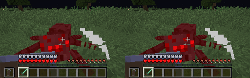

# Object Recognition using Reinforcement Learning (PPO)

This project is an implementation of the Proximal Policy Optimization (PPO) algorithm using PyTorch. It is designed to work with the Minecraft environment provided by MineDojo and integrates Object Detection modules from GroundingDINO to enhance training.

<div align="center">



Right side shows the results of OD after RL training. 
</div>

## Features

- **PPO Algorithm**: Implementation similar to OpenAI's PPO2.
- **Parallel Training**: Supports vectorized environments for efficient experience collection.
- **MineDojo Integration**: Uses Minecraft as the training environment.
- **Object Detection**: Leverages GroundingDINO for improved perception and training feedback.
- **Single Task Agent**: Focused on learning a specific task within Minecraft using reinforcement learning.

## Objective

The primary goal of this project is to explore how reinforcement learning (RL) can be used to train object detection modules. By integrating object detection into the RL pipeline, the agent can refine its perception capabilities while improving policy learning.

## Installation

### Prerequisites

Ensure you have the following installed:

- Python 3.9
- PyTorch
- MineDojo
- GroundingDINO

Follow [MineDojo](https://github.com/MineDojo/MineDojo) installation and [GroundingDINO](https://github.com/IDEA-Research/GroundingDINO) installation

### Setup

1. Clone this repository:

2. Create and activate a virtual environment (optional):
   ```bash
   python -m venv venv
   source venv/bin/activate
   ```
3. Install dependencies:
   ```bash
   pip install -r requirements.txt
   ```

## Usage

### Training the PPO Agent

To start training the agent in the Minecraft environment:

```bash
python train.py --config config.yaml
```


